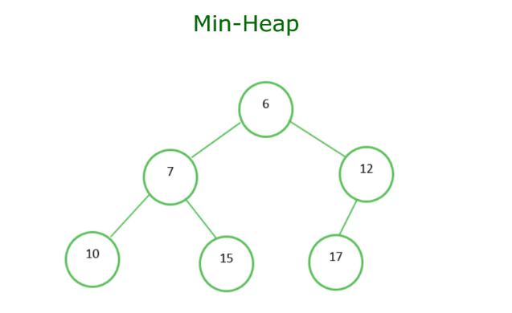
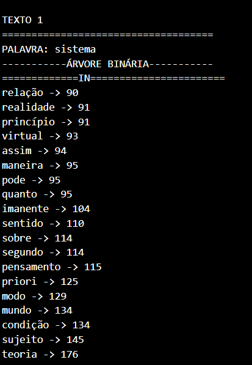
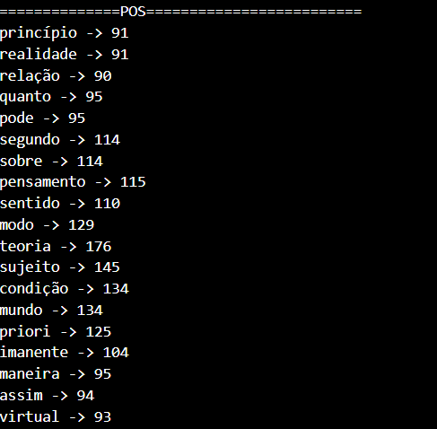
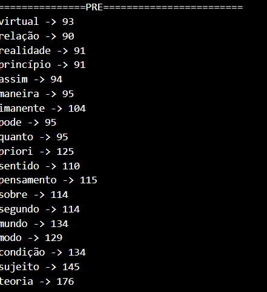
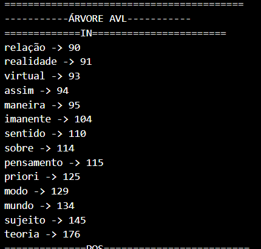
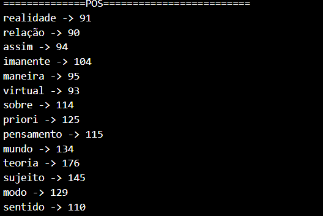
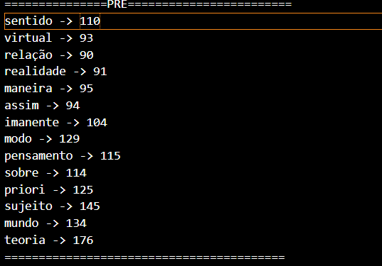
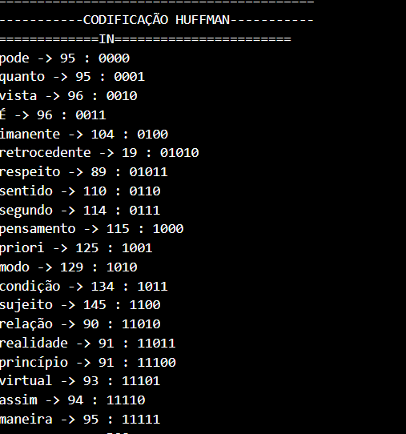
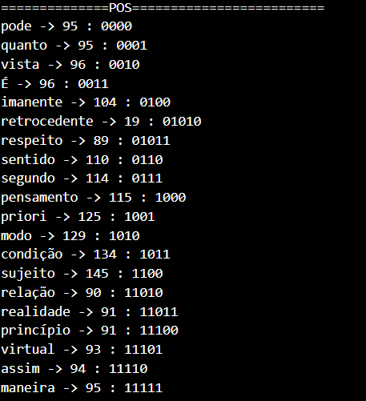
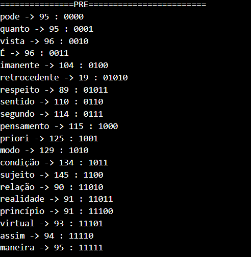

# Introdução ao problema
O seguinte trabalho tem como principal objetivo a criação um sistema de autocompletar e sugerir palavras aos usuarios. Para atingir tal objetivo, foi utilizado a estrutura de árvore binária na implementação do projeto, para uma melhor compreensão de diferentes implementações de árvores binárias foram utilizadas outras estruturas em árvore como a árvore AVL e a codificação de Huffman. Ao final da execução será possível fazer uma análise comparativa entre as três estruturas implementadas. Para a execução do projeto possuimos um arquivo com os termos de pesquisa ```words.txt```, além de arquivos com a estrutura ```input X .data``` em que "X" é um numero inteiro, esses arquivos contém textos que servirão para a coleta de dados para a criação de um Heap com os  TOP-K-itens, também existe o arquivo ```stopwords.txt```, onde possuímos palavras a serem ignoradas quando formos criar a Hash com as palavras do texto. Esse trabalho é um incremento ao trabalho previamente realizado:<a href="https://github.com/joaopedrofreitas/Top-K-Itens"> TOP-K-itens </a>. 

# Estruturas de dados implementadas

## Árvore Binária
A estrutura padrão de uma árvore binária consiste em uma estrutura de nós pais e filhos além de uma raiz, na árvore binária casa nó pai possuí no máximo 2 nós filhos: filho esquerdo e filho direito, como regra de inserção da árvore binária implementada nesse projeto, a inserção é definida pela frequencia de cada palavra contida no Heap, caso a frequencia do item analizado for maior ou igual ao so nó pai esse item se torna o filho direito, caso contrário, ele se torna o filho esquerdo; sendo essa a regra de inserção implementada. os principais métodos da classe ```BINARYTree```:


### insertTree(BINARYTree **t, pair<wstring,int> word)
Essa é a função de inserção principal da Árvore Binária implementada, ela recebe dois argumentos: um ponteiro de ponteiro da classe, onde no caso é a raiz da árvore, e, um ```pair<wstring,int>``` onde é a palavra a ser inserida. na regra de inserção é analisado o segundo termo do par fornecido, no caso a frequencia da palavra.
### preordem(BINARYTree *t,ofstream& outputFile)
Essa função tem como objetivo gravar a árvore binária no arquivo de saída: ```outputFile``` passado como argumento, no momento de gravar a arvore no arquivo de saída a maneira de gravar é de maneira Pré-ordem, isso quer dizer que a maneira de percorrer a árvore é seguindo os nós até chegar nos ramos mais profundos das sub-árvores da esquerda para a direita. conhecido como percurso em profundidade. 
### central(BINARYTree *t,ofstream& outputFile)
Essa função recebe também como argumento o arquivo de saída: ```outputFile``` onde será gravada a árvore, porém, desta vez em ordem simétrica ou In-ordem; primeiro visita todos os nós à esquerda (menores valores, em uma árvore de busca binária), depois o próprio nó atual e, por fim, todos os nós à direita (maiores valores, em uma árvore de busca binária).
### posordem(BINARYTree *t,ofstream& outputFile)
Essa função recebem como argumento o arquivo de saída: ```outputFile```, junto ao ponteiro da raiz da arvore: ```*t```, a gravação no arquivo de saída é de maneira Pós-ordem; Para o caminhamento em pós-ordem, você primeiro visita todos os nós à esquerda e à direita do nó atual antes de visitar o próprio nó atual.

### Clear_BI(BINARYTree *t)
Essa função tem como objetico destruir a árvore por completo, com finalidade da criação de outra árvore. Como argumentos, temos o nó raiz da árvore, é uma função recursiva onde vamos deletar nó a nó da arvore, em cada chamada recursiva da função passamos os nós da esquerda e da direita, deletando toda a árvore. 

## Árvore AVL
A estrutura de uma Árvore AVL se assemelha a uma árvore binária, porém ela é uma árvore binária de altura equilibrada, isso requer que cada subárvore seja de altura equilibrada também. Para tal Balanceamento é calculado o fator de balanceamento, onde para um determinado nó, o fator de balanceamento é a diferença da altura de suas subarvores a direita e a esquerda; O fator de balanceamento pode assumir 3 estados: 0, +1, -1; 

* para 0: as alturas das subárvores a esquerda e direita são iguais.
* para +1: indica que a altura da subárvore a esquerda é maior que a direita.
* para -1: indica que a altura da subárvore a esquerda é menor que a direita.


Há também as rotações realizadas para manter as arvores balanceadas:


* Rotação simples para a direita: Uma rotação simples para a direita ocorre quando a subárvore esquerda de um nó fica mais alta por mais de 1 nível em relação à subárvore direita.
* Rotação simples para a esquerda: Uma rotação simples para a esquerda ocorre quando a subárvore direita de um nó fica mais alta por mais de 1 nível em relação à subárvore esquerda. 
* Rotação dupla para a direita:  Isso é necessário quando uma subárvore esquerda tem um desbalanceamento do tipo "zigzag" (a subárvore esquerda de um nó está alta em relação à subárvore direita, e a subárvore direita da subárvore esquerda do nó também está alta em relação à subárvore esquerda da subárvore esquerda). A rotação dupla para a direita resolve esse desbalanceamento. 
* Rotação dupla para a esquerda: Similar a rotação dupla para a direita, porém nesse caso, o desbalanceamento em "zigzag" ocorre em unma subárvore a direita, ou seja: a subárvore direita de um nó está alta em relação à subárvore esquerda, e a subárvore esquerda da subárvore direita do nó também está alta em relação à subárvore direita da subárvore direita. 


As funções de inserção e gravação no arquivo da arvore AVL são similares as funções implementadas para a árvore binária, com a diferença que, para a inserção é feita a verificação do balanceamento da árvore, sendo também, uma função recursiva. Além das funções de inserção e de gravação no arquivo de saída, a classe ```AVLTree``` possui esses outros métodos:

### getWeight(AVLTree **t);
Recebe como argumento, um nó da árvore AVL, tem como objetivo retornar a altura desse determinado nó.
### getMaxWeight(int left, int right);
Recebe como argumento, um nó da árvore AVL, tem como objetivo retornar a altura máxima da árvore.
### rotacaoSimplesDireita(AVLTree **t);
Recebe como argumento, um nó da árvore AVL, a operação envolve reorganizar os nós de forma que o nó desbalanceado se torne o filho direito do seu antigo filho esquerdo.
### rotacaoSimplesEsquerda(AVLTree **t);
Recebe como argumento, um nó da árvore AVL, a operação envolve reorganizar os nós de forma que o nó desbalanceado se torne o filho esquerdo do seu antigo filho direito.
### rotacaoDuplaDireita(AVLTree **t);
Recebe como argumento, um nó da árvore AVL, a rotação dupla para a direita ocorre quando uma subárvore esquerda sofre uma rotação simples para a esquerda e, em seguida, a árvore resultante sofre uma rotação simples para a direita. 
### rotacaoDuplaEsquerda(AVLTree **t);
Recebe como argumento, um nó da árvore AVL, a rotação dupla para a esquerda é o inverso da rotação dupla para a direita. Ela ocorre quando uma subárvore direita sofre uma rotação simples para a direita e, em seguida, a árvore resultante sofre uma rotação simples para a esquerda. 
### Clear_AVL(AVLTree *t);
Essa função tem como objetico destruir a árvore por completo, com finalidade da criação de outra árvore. Como argumentos, temos o nó raiz da árvore, é uma função recursiva onde vamos deletar nó a nó da arvore, em cada chamada recursiva da função passamos os nós da esquerda e da direita, deletando toda a árvore. 


## Codificação de Huffman ou Árvore de Huffman

Ela possui uma estrura de árvore binária,e sua classificação é por símbolos, cada símbolo é representado como um nó na Árvore de Huffman, cada nó tem um valor (o símbolo) e uma frequência associada (quantas vezes esse símbolo aparece no conjunto de dados), a partir disso através de um processo recursivo, para cada nó, você cria uma "floresta", e para cada nó é realizado o processo de comparação, escolher as duas árvores com a menor frequencia na floresta, criar uma nova arvore com a soma da frequencia das árvores anteriores, e, deletar as duas arvores anteriores, o processo é realizado até que tenhamos apenas uma árvore na floresta, sendo assim, ao final do processo, possuímos apenas uma árvore binária; A atribuição dos codigos é feita da seguinte forma: quando nos movemos da raiz para a folha, atribuimos "0" ao longo de uma aresta se for para a subárvore esquerda e "1" para a subárvore direita. Ela é uma técnica amplamente utilizada em muitos algoritmos de compressão de dados e é fundamental para a compactação de arquivos.

As funções de gravação no arquivo de saída são semelhantes ás funções da ```BINARYTree``` e ```AVLTree```.

### insertH(HUFFMANTree*& t,vector<pair<wstring,int>>& Heap)
Como argumentos recebemos, o Nó raiz da árvore, junto ao Heap que relaciona as palavras com suas respectivas frequencias. Ela tem como objetivo a inicialização/criação da Árvore de Huffman, passando o Heap como um parametro da função, diferentemente das funções de inserção anteriores, onde era passsado para a função palavra por palavra.
### Clear_HF(HUFFMANTree* t)
Essa função tem como objetico destruir a árvore por completo, com finalidade da criação de outra árvore. Como argumentos, temos o nó raiz da árvore, é uma função recursiva onde vamos deletar nó a nó da arvore, em cada chamada recursiva da função passamos os nós da esquerda e da direita, deletando toda a árvore. 


# Lógica de implementação 
## Coleta de dados: Texto a Texto
De inicio criasse um ```unordered_set``` para armazenar as stopwords, através da biblioteca ```<fstream.h>``` é possível realizar a leitura do arquivo ```stopwords.txt```, aramazenando seu conteudo na variável  ```Hash_stopwords```. Já a leitura do arquivo de input, é feita caracter por carater, a cada iteração o caracter é concatenado na variável ```word``` em sua forma minúscula graças a função ```tolower()```,através de um ```switch()``` é analisado qual o carater que o programa está lendo, caso seja um caracter não alfabetico como um sinal de pontuação isso é indício que chegamos ao final de uma palavra, neste caso é chamada a função ```ADD_Main_Hash()``` onde a palavra será adicionada a Tabela de dispersão principal por armazenar a frequência dos itens, dentro da função já feita a verificação se a palavra analisada é uma stopword ou não, caso seja, a palavra não é adicionada. O processo de leitura tem apenas como objetivo armazenar a palavra e sua devida frequência. Após o processo inicial de armazenamento dos itens na "Hash" de frequência, é chamada a função ```init_Heap()``` com o objetivo de criar o nosso Heap que possuirá iniciamente K itens, K é um numero já determinado dentro do programa, porém pode ser alterado no arquivo ```Functions.hpp```, o valor utilizado nos teste foi de 20. Depois da criação do "Heap" inicial começamos a operá-lo, o "Heap" criado é um "Mínimo Heap":

<br>
Exemplo de Mininimo Heap.

sua característica principal é deixar seu menor elemento na sua raíz, sendo assim, para atualizar o Heap a cada comparação é necessário analisar se a palavra apareceu mais vezes que a palavra que está na posição "[0]" do Heap atual.

## Manipulação e modelagem de Estruturas
Junto a criação do ```unordered_set``` para o armazenamento das stopwords é criado outro ```unordered_set``` para aramazenar os termos de pesquisa localizados no arquivo ```words.txt```. Após a criação da tabela de dispersão do texto junto a criação de seu devido Heap com o Top-K-items mais relevantes, é realizada a chamada da função ```Check_words``` onde os termos de pesquisa serão processados; A priori é verificado se o termos em questão está no texto, verificando se a palavra está na ```Main_Hash```, se o termo não estiver ele é completamente ignorado, caso contrário é feita uma segunda verificação: se o termo de pesquisa está no Heap, caso não, o heap do texto analisado será enviado para as funções: ```insertBinaryT```, ```insertAVL```, ```insertHuffman```, onde as três principais estruturas Árvore binária, Árvore AVL e Codificação de Huffman serão construidas com o determinado Heap e logo após sua construção elas serão gravadas em um arquivo de saída: ```output.txt``` onde as estruturas criadas serão gravadas de três maneiras diferentes: ```pós-ordem```,```pre-ordem```, ```pós-ordem```; Caso o termo de pesquisa esteja no Heap o processo é basicamente o mesmo porém o Heap enviado para a construção das estruturas é alterado antes, no caso, se o termo estiver no Heap, ele é removido do Heap e é chamada a função ```ADD_Kplus1_Item``` onde será adicionado no Heap o Top K elemento mais um, sendo assim a única diferença é que o Heap será alterado.

# Exemplo de sáida
Exemplo de saída, no arquivo de saída ```output.txt```:

<br>
<br>
<br>
<br>
<br>
<br>
<br>
<br>
<br>

Como é possível analisar, para cada termo de pesquisa, temos 9 saídas: 3 maneiras de caminhamento em 3 estruturas diferentes.
# Conclusões
Com a realização do projeto:<a href="https://github.com/joaopedrofreitas/Top-K-Itens"> TOP-K-itens </a>, foi possível observar e analisar a importancia de estrutura de dados para a coleta e o processamento de grandes massas de dados, no trabalho prévio, utilizamos das estruras de Hash para o armazenamento de uma grande massa de dados e a estrutura de Heap para o seu devido processamento, neste trabalho, foi incrementado ao projeto anterior a utilização de 3 novas estruturas: Árvore Binária, Árvore AVL e Codificação de Huffman para também processar grandes massas de dados.

A árvore binária e AVL, se apresentam semelhantes em quesito de estruturação, porém se diferem em como processam os dados, na árvore binária não há o rebalanceamento de sua estrutura, ela tem um crescimento que não é controlado, isso pode afetar nos tempos de busca/pesquisa, remoção,etc. Já na árvore AVL há sempre um fator de balanceamento que garante que ela vai estar sempre aproximadamente balanceada, ajudando no tempo de pesquisa/busca, remoção,etc. Para esse trabalho, a árvore binária leva desvantagem em relação a AVL, uma vez que possuímos uma grande massa de dados é necessário prezar pelo tempo de pesquisa e remoção da árvore, uma vez que, a binária tende a ficar desbalanceada, esse tempo tende a crescer mais rápido do que em comparação á AVL, já que a mesma possuí mecanismos de balanceamento.

Já a codificação de Huffman, se torna útil por outro motivo, a compactação de um texto, uma vez que ela gera códigos binários para as palavras de um determinado texto, sendo esses, baseados em sua frequencia. 

As três estruturas se tornam úteis de maneiras diferentes e possuem características únicas que vão influenciar na sua escolha de implementação, a árvore binária possuí uma implementação simples e compacta, para pequenas massas de dados, ela pode ser bastante útil, porém como foi dito, a AVL para grandes massas de dados leva vantagem, graças aos mecanismos de balanceamento, porém possuí uma implementação bem mais ampla e complexa. A codificação de Huffman se tornará bastante útil, na compactação do texto. A decisão de implementação depende das finalidades do usuário.

# Instruções de compilação e execução
<p>
    <i>Este código possui um arquivo Makefile que facilita a compilação e execução do programa</br>As diretrizes de execução deste
    Make file são:<i>
    <table border="1">
      <tr><td><u>make clean</u></td> <td>Apaga a última compilação realizada contida na pasta build</td></tr>
      <tr><td><u>make</u></td> <td>Executa a compilação do programa utilizando o gcc, e o resultado vai para a pasta build.</td></tr>
      <tr><td><u>make run</u></td> <td>Executa o programa da pasta build após o programa já estar compilado </td></tr>
    </table>
    <i>Para a execução do programa utilize <u>make</u> para realizar a compilação e logo após utilize <u>make run</u> para executar o programa</i>
</p>

# Autor
E-mail: joaopedrofdpd2205@gmail.com</br>
4° Período-2023-Engenharia de Computação-CEFET-MG


